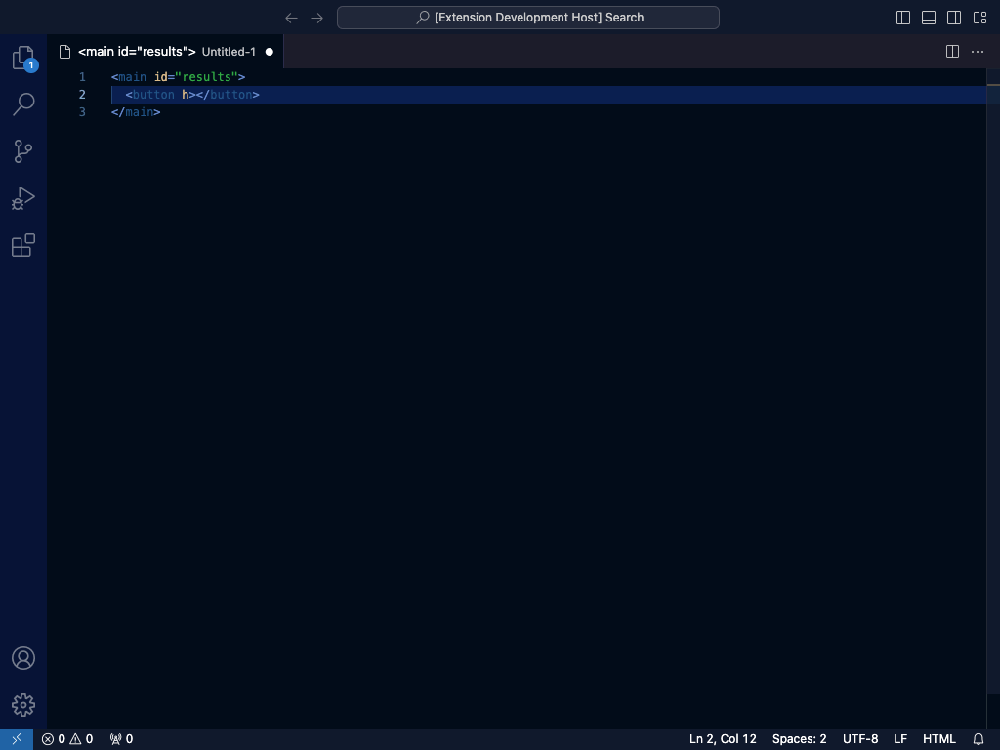
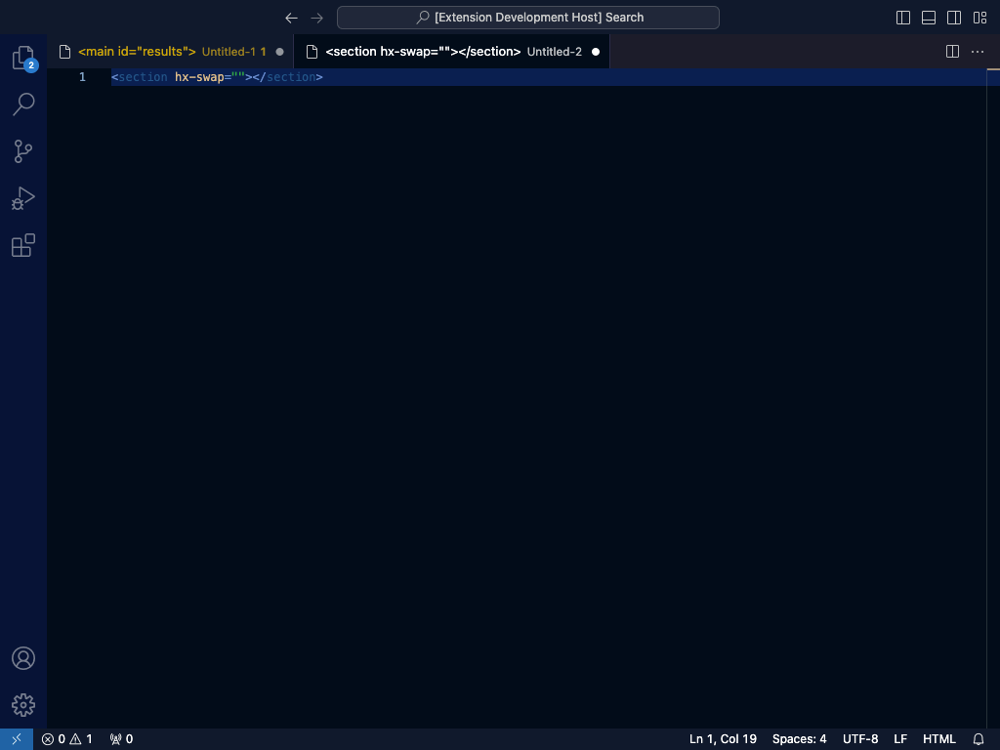
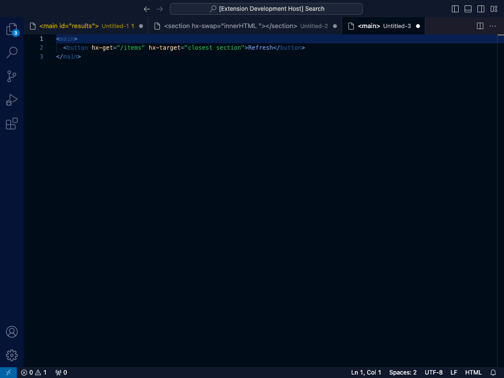

# HTMX Tags for Django

Write HTMX faster in VS Code. HTMX Tags for Django adds completions, value suggestions, hover docs,
diagnostics, and Django 6 partial support to HTML, Django templates, and Python views—entirely offline.

[Install from the Visual Studio Marketplace](https://marketplace.visualstudio.com/items?itemName=difegam.htmx-tags-django)

## Install and use

1. Open **Extensions** in VS Code (`Ctrl/Cmd+Shift+X`).
2. Search for **HTMX Tags for Django** and install it.
3. Open an `html` or `django-html` template and start typing `hx-`.

Django template support uses the [Django extension](https://marketplace.visualstudio.com/items?itemName=batisteo.vscode-django), which VS Code installs as an extension dependency.

## What you get

- Complete `hx-*` attributes and documented values for swaps, targets, triggers, encodings, and methods.
- Use the same help with `data-hx-*` aliases, `hx-on:*`, response targets, and HTMX 4 modifiers.
- Hover for concise documentation, version availability, and official HTMX links.
- Catch clear HTMX typos and invalid documented values without warning on ordinary HTML or Django expressions.
- Complete and navigate Django 6 partial tags locally or through static `template.html#partial` references.
- Insert Django-ready GET, CSRF-safe POST, delete, search, infinite scroll, and partial snippets.

## Editor experience

### Attribute Completions

> **Find the right HTMX attribute without leaving your template.** Type `hx-` in HTML or Django HTML to see version-aware attributes, aliases, dynamic syntax, and Django-ready snippets.



### Context-Aware Value Completions

> **Get values that match the attribute you are editing.** `hx-swap`, `hx-trigger`, and `hx-target` suggest documented strategies, events, and modifier fragments exactly where you need them.



### Hover Documentation

> **Understand an attribute at a glance.** Hover a recognized `hx-*` or `data-hx-*` attribute for its purpose, supported HTMX versions, suggested values, and official documentation links.



### Diagnostics and Django partials

| Compatible diagnostics | Django partial completion |
| --- | --- |
|  |  |

## Built for Django templates

Definitions in the current template are offered after `{% partial `:

```django

  <article id="result-{{ result.pk }}">{{ result.title }}</article>



```

Go to Definition and Peek Definition jump from `` to its local definition. Static cross-template references also complete and navigate from Django includes and common Python APIs:

```django

```

```python
return render(request, "results.html#result_card", context)
```

Cross-template lookup scans matching workspace files on demand. When multiple apps contain the same template path, VS Code shows every matching definition rather than guessing Django's runtime loader order.

## HTMX version support

The committed catalog covers HTMX `2.0.10` and `4.0.0-beta5`. `compatible` mode is the default: it accepts their union without version warnings. Choose `2` or `4` when you want cross-version syntax surfaced as hints.

## Settings

| Setting | Default | Purpose |
| --- | --- | --- |
| `htmxTags.enableCompletion` | `true` | Enable HTMX and Django partial completions. |
| `htmxTags.enableHover` | `true` | Enable attribute and partial hover information. |
| `htmxTags.enableValidation` | `true` | Enable HTMX and same-file partial diagnostics. |
| `htmxTags.version` | `compatible` | Use `compatible`, `2`, or `4`. |

## Django snippets

Type a snippet prefix in a `django-html` document to insert a secure Django-ready HTMX pattern.
See the [snippet and example catalog](docs/reference/snippets.md) for every prefix and its generated output.

## Offline by design

The extension packages its generated HTMX catalog and never requests documentation or metadata at runtime.

## Contributing

```bash
npm install
npm test
npm run test:extension
npm run package
```

Regenerate the committed offline catalog from the pinned HTMX `2.0.10` and `4.0.0-beta5` tags:

```bash
npm run build-data
```

Add or update a snippet once in `snippets/django-htmx.source.json`, then regenerate its runtime
definition and documentation together:

```bash
npm run build-snippets
```

## Documentation

Read the [full documentation](docs/index.md) for setup, HTMX authoring, partials, configuration, packaging, and release guidance.

## License

Licensed under Apache 2.0. This community fork is maintained at [difegam/htmx-tags](https://github.com/difegam/htmx-tags) and builds on the original [otovo/htmx-tags](https://github.com/otovo/htmx-tags).
