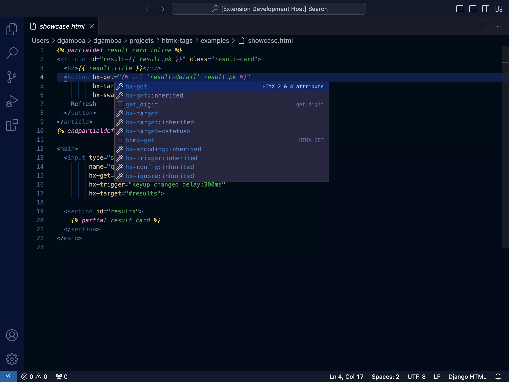
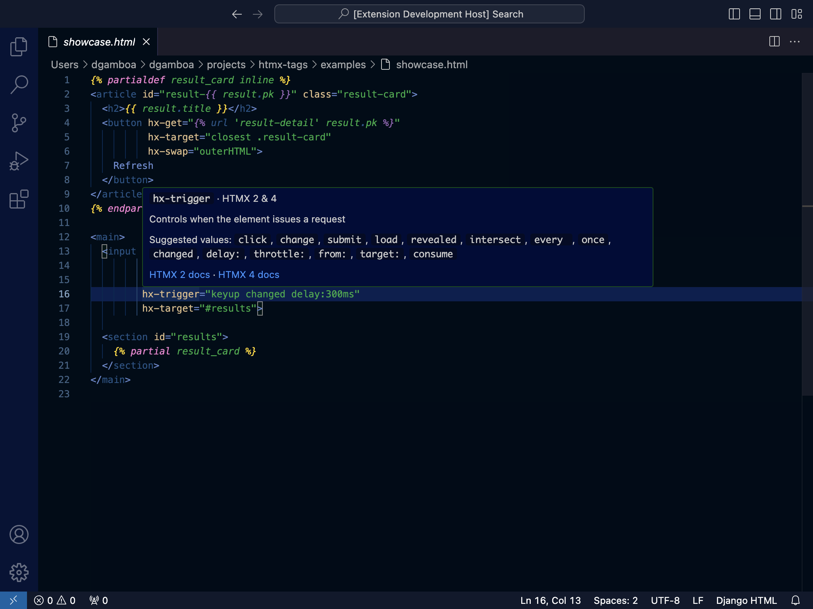
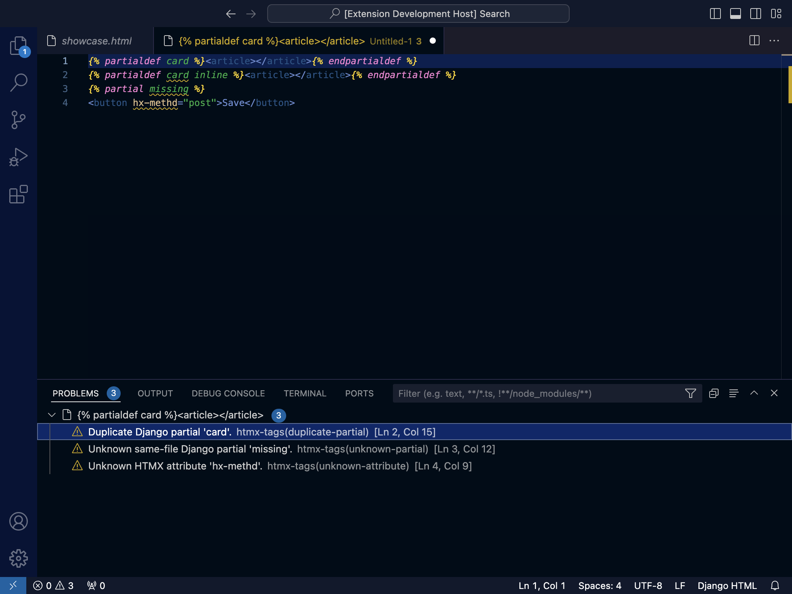
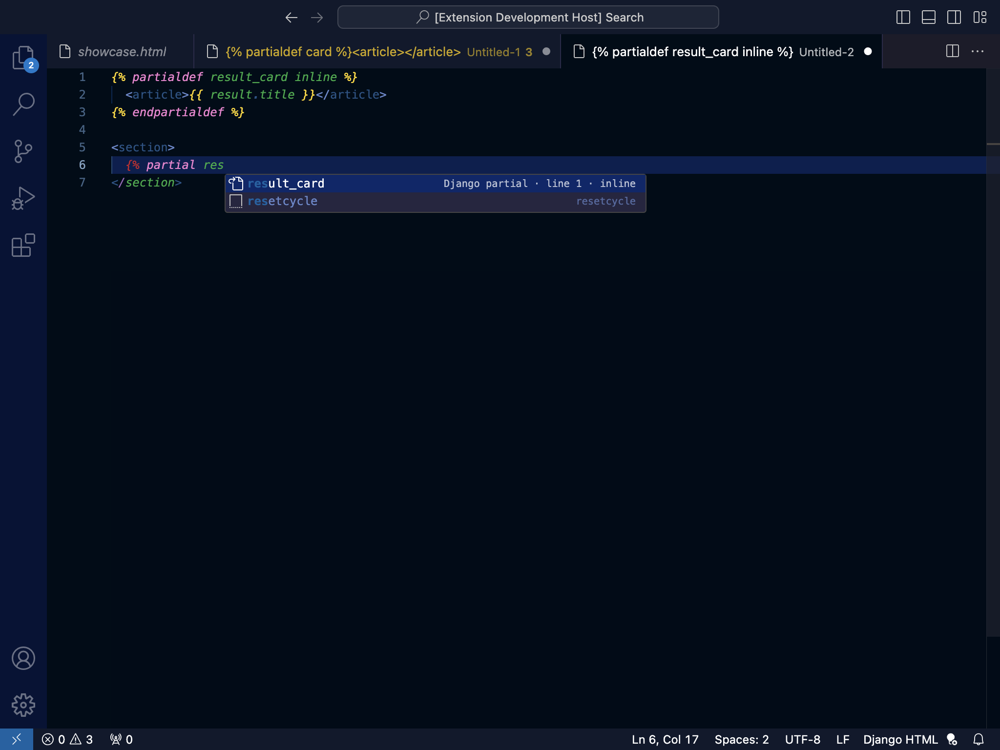

# HTMX Tags for Django

Focused HTMX IntelliSense for HTML and Django templates in VS Code. The extension understands the
stable HTMX 2 API, the HTMX 4 beta, `data-hx-*` aliases, dynamic attributes, and Django 6 same-file
template partials without making network requests at runtime.

## Features

- Context-aware `hx-*` and `data-hx-*` attribute completion in `html` and `django-html` files.
- Quote-aware insertion and documented values for swaps, targets, triggers, encodings, and methods.
- Hover documentation with version availability and official HTMX links.
- Compatible diagnostics for clear typos and invalid closed-set values.
- Dynamic syntax support including `hx-on:*`, `hx-target-4*`, `hx-status:5xx`, `:inherited`, and
  `:append`.
- Django 6 `` completion, hover, duplicate detection, and unknown-reference checks.
- Django-focused snippets for common HTMX request and partial patterns.

## Editor experience

| HTMX completion | Rich hover documentation |
| --- | --- |
|  |  |

| Compatible diagnostics | Django partial completion |
| --- | --- |
|  |  |

## Django partials

Definitions in the current template are offered after `{% partial `:

```django

  <article id="result-{{ result.pk }}">{{ result.title }}</article>



```

The extension intentionally does not build a project-wide template index or inspect Python view
references such as `template.html#result_card`.

## Version modes

| Setting | Default | Purpose |
| --- | --- | --- |
| `htmxTags.enableCompletion` | `true` | Enable HTMX and Django partial completions. |
| `htmxTags.enableHover` | `true` | Enable attribute and partial hover information. |
| `htmxTags.enableValidation` | `true` | Enable HTMX and same-file partial diagnostics. |
| `htmxTags.version` | `compatible` | Use `compatible`, `2`, or `4`. |

`compatible` accepts the HTMX 2/4 union without version noise. Explicit `2` or `4` modes limit
completion to that major and show other-version or deprecated syntax as hints rather than errors.

## Django snippets

Type one of these prefixes in a `django-html` document:

- `htmx-get`, `htmx-post`, `htmx-delete`, `htmx-search`, `htmx-infinite`
- `partialdef`, `partialdef-inline`, `partial`

## Development

```bash
npm install
npm test
npm run test:extension
npm run package
```

Regenerate the committed offline catalog from the pinned HTMX `2.0.10` and `4.0.0-beta5` tags:

```bash
npm run build-data
```

The generated catalog is the only runtime documentation source; the extension does not access the
network after installation.

## Documentation

The [documentation site](docs/index.md) has task-focused installation, HTMX authoring, Django
partials, configuration, contributor, packaging, and release guides.

## License and credits

Licensed under Apache 2.0. This community fork is maintained at `difegam/htmx-tags` and builds on
the original `otovo/htmx-tags` project.
