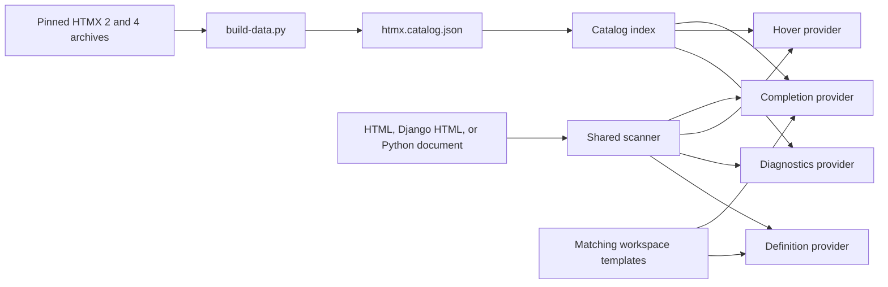

# Architecture

The extension turns a committed HTMX catalog and one shared scanner into editor features without runtime dependencies or network access.

## Build-time catalog

`build-data.py` merges HTMX `2.0.10` and `4.0.0-beta5` documentation into `htmx.catalog.json`. Each canonical attribute records descriptions, available major versions, version-specific official categories, documentation URLs, documented values, modifiers, deprecation metadata, and dynamic-name patterns. HTMX 2 categories come from its Core and Additional reference tables; HTMX 4 categories come from its exported attribute groups. The generated file is committed and CI regenerates it to detect drift.

## Runtime providers

`src/catalog.ts` loads the catalog, normalizes `data-hx-*` names to canonical `hx-*` names, and resolves dynamic patterns. `src/scanner.ts` is shared by completion, hover, and diagnostics so all features interpret multiline and incomplete tags consistently.

The scanner skips HTML comments, Django comments, `` and `` regions, and script/style bodies. It preserves Django expressions in attribute values, recognizes same-file `` and `` tags, and finds static cross-template partial references in Django includes and supported Python calls.

`src/extension.ts` registers HTMX providers for `html` and `django-html`, plus partial completion and definition providers for `django-html` and Python. Cross-template requests find matching workspace files and scan them on demand. Diagnostics remain limited to HTML and Django HTML; they are debounced after document changes, cleared when a document closes, and recomputed when `htmxTags` settings change.

## Design boundaries

- The extension has no runtime dependencies and makes no runtime HTTP requests.
- The catalog stores canonical attributes only; aliases are synthesized during lookup and completion.
- Partial definitions are not indexed across a workspace, and template lookup does not model Django settings or loader order.
- Diagnostics intentionally warn only for clear HTMX typos, closed-set literal errors, duplicate local definitions, and unknown local references.
