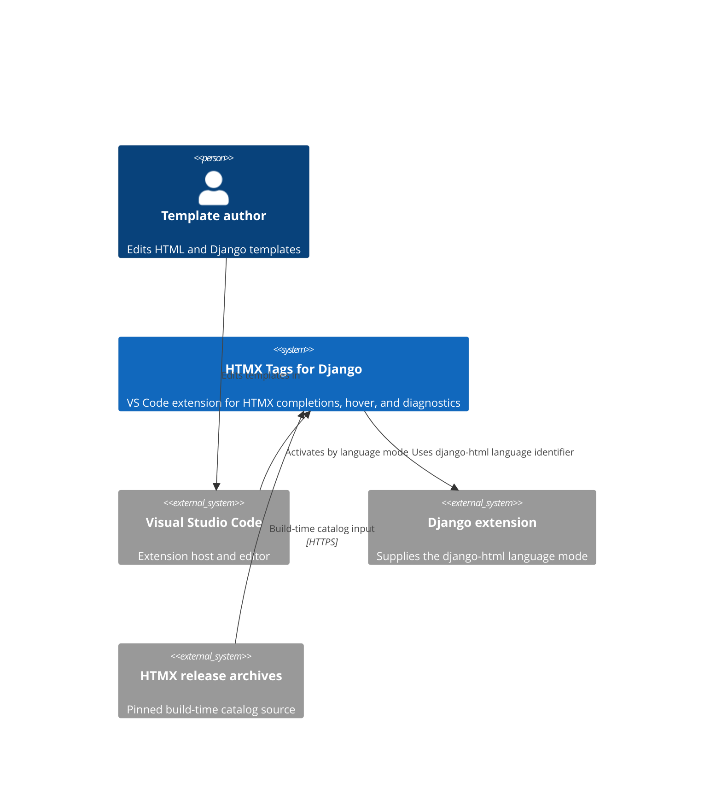

# HTMX Tags for Django

Documentation for the VS Code extension that provides offline HTMX IntelliSense and same-file Django template partial support.

## What is documented here

Use this site to install the extension, author HTMX attributes, configure HTMX 2/4 behavior, work with Django partials, and maintain the generated catalog and VSIX package.

The installed extension runs locally in VS Code. It reads the committed catalog and does not make runtime network requests; release archives are fetched only when a contributor regenerates the catalog.

## Start here

| Need                                        | Read                                                  |
| ------------------------------------------- | ----------------------------------------------------- |
| Install and verify the extension            | [Installation](start-here/installation.md)            |
| Create a first HTMX-enabled Django template | [First template](start-here/first-template.md)        |
| Understand version modes and scope          | [Compatibility](explanation/compatibility.md)         |
| Configure editor behavior                   | [Configuration](how-to/configuration.md)              |
| Contribute or package a change              | [First contribution](tutorials/first-contribution.md) |

## Documentation map

- [Start Here](start-here/index.md) covers installation and the first useful template.
- [Explanation](explanation/index.md) describes the offline runtime model and compatibility behavior.
- [Tutorials](tutorials/index.md) cover local docs and extension contribution workflows.
- [How-to Guides](how-to/index.md) solve common authoring, configuration, and partial tasks.
- [Operations](operations/index.md) covers CI, VSIX inspection, and releases.
- [Reference](reference/index.md) lists settings, catalog syntax, and snippets.
